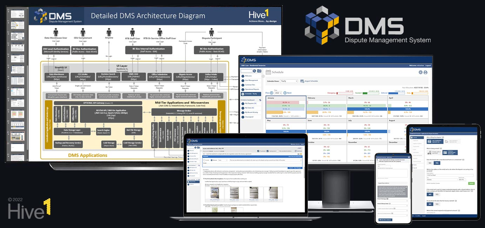
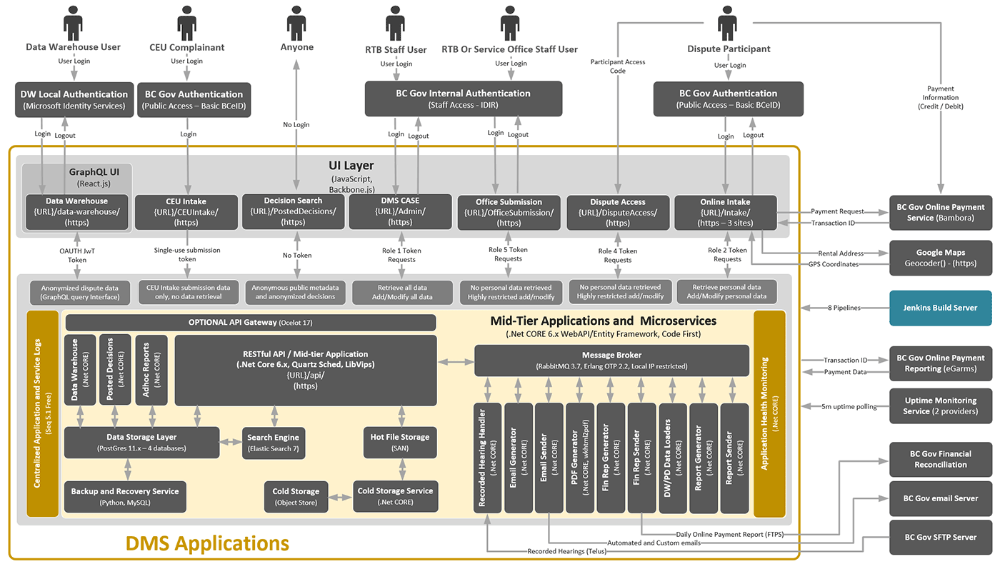

## DMS (Dispute Management System) Open-Source Alpha Release 0.1
May 11, 2022

Tribunal, appeal, dispute resolution and complaint organizations face numerous challenges.  They are separated from related business sectors for judicial fairness reasons and have unique domains of legislative authority and responsibility.  Most of these organizations exist in a space that is largely devoid of available technology solutions that both align with available budgets and address their core needs.  These organizations are also facing increasing caseloads, increasing case complexity, and common global challenges like labour shortages that other industries are able to address through bespoke technology and sector-based innovation.

The DMS (Dispute Management System) was designed as a solution for these specific sector problems.  It is an advanced case management system that combines an extensive array of open-source tools and custom software to transform dispute resolution and digital service delivery for justice organizations.  This is a complete ground-up dispute resolution platform with extensive industry-leading features and capabilities.

Although this system was architected to address the shared needs of a wide variety of resolution organizations and their common use cases, this version contains custom code and configurations that are specific to our British Columbia first mover organization. Although we are planning to create a generic base version, we will need to confirm adequate interest in this solution in order to justify the associated costs and additional work. 

The DMS project still has a year of funded development that will further expand its extensive capabilities and add powerful new features. We plan to update this repository when these remaining features are code-complete and deployed for production use.

The version of this code is from the DMS production Release 1.03.02.01.  This is an unsupported open-source repository that was published to share the code base with those that may benefit from its public availability.  We are initiating engagement with the broader dispute resolution marketplace to seek open-source sharing and contribution opportunities.  Our intent is to create a community of suitable co-investors and contributors that will achieve significant cost savings and technological innovation through open-source sharing.   If you are a resolution organization interested in leveraging the DMS solution, please contact Hive One through our justice services web site www.hive1-js.com and we will add you to our list that we are vetting for suitability as the second and third movers (that will be critical to the establishment a viable and sustainable community).

## DMS Production Volumes

The DMS has been in high-volume production use in British Columbia, Canada for 2+ years. Over this timeframe the DMS has proven to be high performing, accessible, and reliable.

The following general information was provided to help describe the size and scale of the current production deployment.

| Item   | Production Statistic(s) | 
| ------- | ------------ |
| Code size | 850,000+ lines (mid-tier and UI) |
| API's | 300+ RESTful API’s + 1 complex GraphQL API (all with security and access rights) |
| API interactions | 1,200,000+ API calls per month, 25,000+ user logins per month |
| Data volumes | 20,000,000+ rows of data, 100+ tables in 4 Postgres Databases |
| Case volumes | 40,000+ case files initiated per year, 20,000+ case files processed per year |
| Uploaded files | 1,800,000+ files (2.5TB+), 500,000+ structured evidence files uploaded per year | 
| Email volumes | 190,000+ automated deliveries, notifications and reminders per year |
| Decision volumes | 25,000+ decisions, settlement agreements and orders per year |
| Schedule volumes | 12,500+ scheduled hearings (and resolution events) per year |
| External users | 85,000+ users per year |
| External workers | 400 users (Service BC) |
| Internal staff | 100 users |

## DMS Solution Organization and Architecture

The system is divided into two main applications.  A micro-services based mid-tier (C#, .NET core 6.0) and a site-based rich client User Interface (UI) (JavaScript, JavaScript frameworks)

**src/mid-tier:** At its core the mid-tier is a micro-services based suite of applications developed in C# .Net core 6.x that provides secure external access through over 300 RESTFUL API’s and a GraphQL Data Warehouse API.   The system is architected to allow Siteminder, local accounts, or OAUTH2 for authentication and the granting of UI tokens.  This version is based on external SiteMinder authentication and integration.  The system is designed to allow hosting using Amazon S3, OpenShift/Kubernetes, Docker, Microsoft Azure and Windows Server.  Due to the high volumes of evidence files and storage limitations of BC government hosting at the time of initial release (1,800,000+ files, 2.5+TB) the solution is currently deployed on Windows Server.  There are Jenkins pipelines for dev, staging/uat, pre-production and production environments for full release control. More information is available in the [src/mid-tier/readme.md](/src/mid-tier/README.md) document.  

**src/ui:** The front end was developed using JavaScript and JavaScript frameworks and is based on 7 individual sites with distinct business, service access, security and privacy objectives. There are Jenkins pipelines for dev, staging/uat, pre-production and production environments for full release and testing control.  In this configuration, several of the UI sites are protected by SiteMinder (protecting their deployed URL/folder).  More information is available in the [src/ui/readme.md](/src/ui/README.md) document.

## DMS Open Source License

MIT: with a license and copyright notice, and a promotion and advertising notice.  See the [LICENSE.txt](LICENSE) for details.

## DMS Contributions

This repository is not currently being managed and code contributions are not being reviewed and/or accepted/merged at this time. This repository contains a single master branch and has been intentionally stripped of the development, staging, feature, and ticket branches necessary used for the ongoing management of this complex codebase.  Hive One has mature gitflow, scope and code management processes that will be described and applied to this open-source repository should suitable investors and co-contributors be identified.   

## DMS Deployment and Configuration

The initial setup of the current DMS system is complex.  This build contains several BC government and internal micro-service integrations, numerous CRON jobs, and a variety of client-specific configurations.  Many configurations are applied through protected settings and secret files not included in this repository or code base for security purposes.  Jenkins build scripts for the current pipelines are included, but without a complete base system configuration the code base will not run.   We plan to setup a docker deployment with default configurations in the future that will be relatively easy for someone with dev ops experience to spin up.  More information on the system setup is provided in the [src/mid-tier/readme.md](/src/mid-tier/README.md) and [src/ui/readme.md](/src/ui/README.md) documents.
